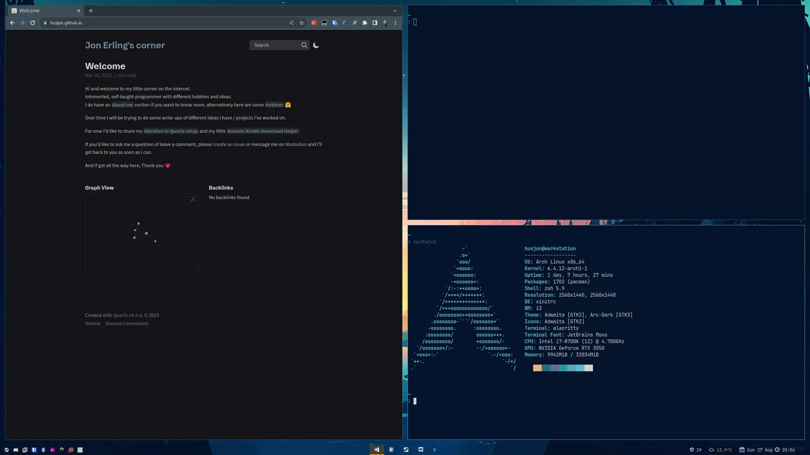
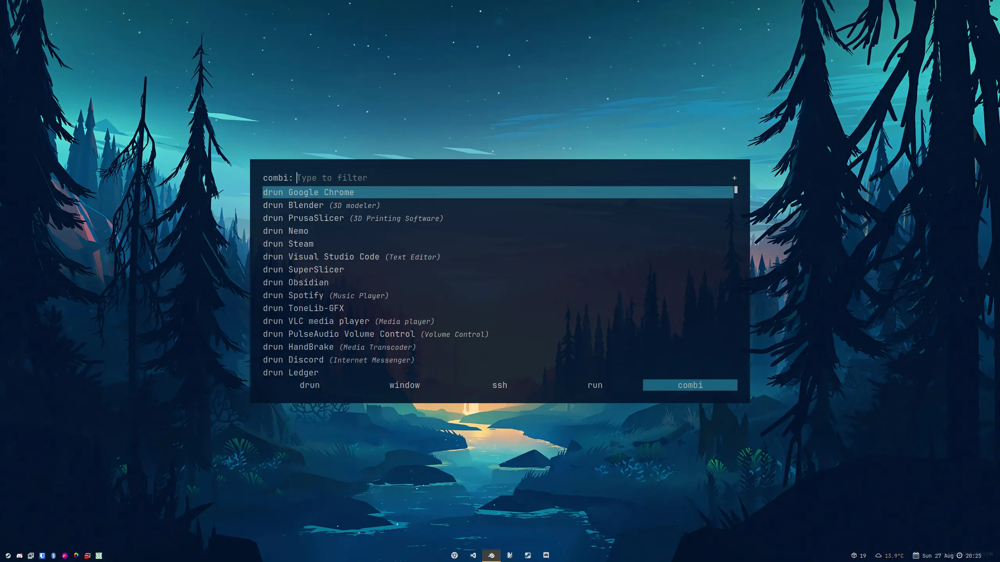
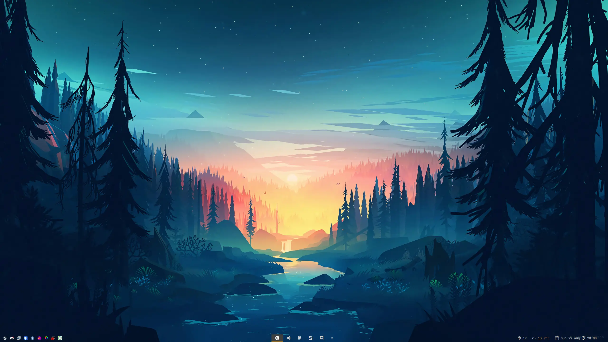

# Dotfiles

My dotfiles that I use across different machines.  
I use [YADM](https://github.com/TheLocehiliosan/yadm) (Yet Anoter Dotfiles Manager) to manage them by using templates.

## Notable applications
### Polybar
I use [Polybar](https://github.com/polybar/polybar) with a couple of self-made modules.  

#### Modules
* [Weather](https://github.com/husjon/polybar_module-weather)  
  Uses OpenWeatherMap to fetch the weather information for my area.
* [Restart Required](https://github.com/husjon/polybar_module-restart_required)  
  A simple bash script to check if a restart is required (f.ex after updating the kernel).
* [Available Packages](https://github.com/husjon/polybar_module-available_packages)  
  Checks if there are available packages and if so, how many.

### Rofi
I use [Rofi](https://github.com/davatorium/rofi) ([screenshot below](#rofi)) as my dmenu app launcher.

## Screenshots
### In use

### Rofi

### Empty

